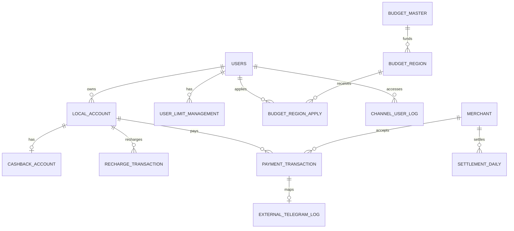

# 지역화폐 통합 플랫폼 데이터베이스 의사결정 보고서

## 1. 문서 목적

이 문서는 지역화폐 통합 플랫폼 데이터베이스를 설계하면서 합의한 구조, 선택 이유, 제약조건, 운영 원칙과 향후 검토사항을 기록한다.

주요 목표는 다음과 같다.

- 앱에서는 여러 지역화폐를 하나의 통합 지갑처럼 제공한다.
- 데이터베이스에서는 지역별 계좌와 원장을 독립적으로 관리한다.
- 충전, 결제, 캐시백, 예산, 한도, 정산을 추적 가능한 형태로 저장한다.
- 금융성 거래의 무결성, 감사 가능성, 개인정보 보호를 우선한다.

## 2. 핵심 결론

| 구분 | 결정 | 상태 |
|---|---|---|
| 사용자와 계좌 | 한 명의 사용자가 여러 지역별 계좌를 보유하는 `USERS 1:N LOCAL_ACCOUNT` 구조 | 확정 |
| 지역별 원장 | 서울·경기·부산 등 지역별 충전금과 거래를 각각의 계좌로 분리 | 확정 |
| 캐시백 원장 | 지역화폐 계좌마다 최대 하나의 `CASHBACK_ACCOUNT`를 연결 | 확정 |
| 캐시백률 | `BUDGET_REGION.cashback_rate`로 지역·연도·정책별 캐시백 비율 조절 | 반영 완료 |
| 예산 | `BUDGET_MASTER`에서 지역·연도 단위의 총예산과 집행액 관리 | 확정 |
| 개인 한도 | `USER_LIMIT_MANAGEMENT`에서 월 누적 결제액과 캐시백을 관리 | 현재 구조 유지, 범위 보완 검토 |
| 정규화 | 기본 구조는 3정규형을 지향하고 조회 성능이 중요한 집계·잔액은 선택적으로 비정규화 | 확정 |
| DBMS | DBeaver 사용  | 확정 |
| 명명 규칙 | 테이블·컬럼은 영문 `snake_case`, PK와 FK는 동일한 식별자 이름 사용 | 확정 |

## 3. 시스템 범위

### 3.1 계정계

고객, 지역화폐 계좌, 캐시백 원장, 충전, 결제, 예산, 정책 신청, 개인 한도와 가맹점 정산을 담당한다.

### 3.2 채널계

앱 접속 일시, IP, 기기 식별값과 로그인 성공 여부를 기록한다.

### 3.3 대외계

결제 거래와 외부기관 전문의 송수신 결과를 연결해 기록한다.

## 4. 현재 ERD 구조



현재 범위는 13개 테이블을 기준으로 한다.

| 영역 | 테이블 | 역할 |
|---|---|---|
| 계정계 | `USERS` | 고객의 식별정보와 상태 관리 |
| 계정계 | `LOCAL_ACCOUNT` | 고객의 지역별 충전금 원장 |
| 계정계 | `CASHBACK_ACCOUNT` | 계좌별 캐시백 잔액 관리 |
| 계정계 | `RECHARGE_TRANSACTION` | 충전 거래 이력 |
| 계정계 | `PAYMENT_TRANSACTION` | 결제, 캐시백 사용·적립, 거래 후 잔액 기록 |
| 계정계 | `BUDGET_MASTER` | 지역·연도별 캐시백 예산 관리 |
| 계정계 | `BUDGET_REGION` | 정책별 인원, 결제 한도, 캐시백 한도와 비율 관리 |
| 계정계 | `BUDGET_REGION_APPLY` | 사용자별 정책 신청 상태 관리 |
| 계정계 | `USER_LIMIT_MANAGEMENT` | 사용자별 월 결제·캐시백 누계 관리 |
| 계정계 | `MERCHANT` | 가맹점과 자격정보 관리 |
| 계정계 | `SETTLEMENT_DAILY` | 가맹점별 일일 정산 관리 |
| 채널계 | `CHANNEL_USER_LOG` | 앱 접속과 로그인 결과 기록 |
| 대외계 | `EXTERNAL_TELEGRAM_LOG` | 외부기관 전문 송수신 결과 기록 |

## 5. 주요 설계 의사결정

### 5.1 통합 지갑과 지역별 원장 분리

화면에서는 사용자가 보유한 지역화폐를 하나의 지갑처럼 보여줄 수 있다. 그러나 데이터베이스에서는 `LOCAL_ACCOUNT`를 지역별로 분리한다.

예를 들어 한 사용자가 서울과 경기 지역화폐를 모두 사용하면 다음과 같이 저장한다.

```text
USERS 100001
├─ LOCAL_ACCOUNT 200001 / SEOUL
└─ LOCAL_ACCOUNT 200002 / GYEONGGI
```

이 구조를 선택한 이유는 다음과 같다.

- 지역별 잔액, 예산, 정책과 사용처를 독립적으로 관리할 수 있다.
- 서울 계좌의 결제가 경기 계좌 잔액에 영향을 주는 오류를 방지할 수 있다.
- 지역별 정책 또는 한도가 달라져도 확장하기 쉽다.

`LOCAL_ACCOUNT`에는 `(user_id, region_code)` UNIQUE 제약을 두어 사용자당 동일 지역 계좌가 중복 생성되지 않도록 하는 것을 권장한다.

### 5.2 지역별 캐시백률

지역별 캐시백 비율을 조절하기 위해 `BUDGET_REGION`에 다음 컬럼을 추가했다.

```sql
cashback_rate NUMERIC(5,2) NOT NULL
```

권장 표현 방식은 `10.00 = 10%`이다. 이 기준을 사용하면 기본 캐시백 계산식은 다음과 같다.

```text
기본 캐시백 = 캐시백 산정 대상 결제액 × cashback_rate ÷ 100
```

최종 적립액은 기본 캐시백을 그대로 사용하지 않고 아래 조건을 모두 반영해 결정한다.

```text
최종 캐시백 = MIN(
    기본 캐시백,
    개인 월 캐시백 잔여 한도,
    지역의 가용 예산
)
```

`cashback_rate`에는 다음 제약을 권장한다.

```sql
CHECK (cashback_rate >= 0 AND cashback_rate <= 100)
```

결제 당시 실제 적립액은 `PAYMENT_TRANSACTION.earn_cashback_amt`에 저장한다. 향후 정책 변경 이력을 더 정확히 추적해야 한다면 결제 테이블에 적용 정책 ID 또는 적용 캐시백률 스냅샷을 추가한다.

### 5.3 캐시백 우선 차감

결제 시 캐시백을 우선 사용하고 나머지를 실충전금에서 차감한다.

```text
총 결제액 = 캐시백 사용액 + 실충전금 결제액
```

승인된 거래에는 다음 검증이 필요하다.

```sql
CHECK (total_tx_amt = use_cashback_amt + pay_cash_amt)
```

잔액 확인, 차감, 캐시백 적립, 예산 집행과 결제 거래 저장은 하나의 DB 트랜잭션으로 처리한다. 중간 단계에서 오류가 발생하면 전체 작업을 롤백한다.

### 5.4 예산과 모집 인원

`BUDGET_MASTER`의 기본키는 `(region_code, target_year)` 복합키이다. 따라서 `BUDGET_REGION`도 두 컬럼을 함께 참조하는 복합 외래키를 사용해야 한다.

```sql
FOREIGN KEY (region_code, target_year)
REFERENCES BUDGET_MASTER (region_code, target_year)
```

`BUDGET_REGION`은 다음 정책값을 관리한다.

- 최대 참여 인원
- 현재 참여 인원
- 개인별 월 결제 한도
- 개인별 월 캐시백 한도
- 지역·정책별 캐시백률
- 모집 상태와 적용 기간

동일 사용자의 중복 신청은 다음 제약으로 방지한다.

```sql
UNIQUE (policy_id, user_id)
```

### 5.5 가맹점과 정산

결제 거래는 `MERCHANT`를 참조한다. 일일 정산은 가맹점과 정산일을 기준으로 한 건만 생성되도록 다음 제약을 권장한다.

```sql
UNIQUE (settlement_date, merchant_id)
```

정산 계산의 기본 규칙은 다음과 같다.

```text
실지급액 = 총 결제 매출액 - 수수료 금액
```

## 6. 정규화 및 비정규화 원칙

현재 구조는 1NF부터 3NF까지를 기본 방향으로 한다. 다만 금융·결제 시스템에서 조회 성능과 동시성 처리가 중요한 일부 값은 의도적으로 중복 저장한다.

| 컬럼 | 원천 데이터 | 판단 |
|---|---|---|
| `LOCAL_ACCOUNT.cash_balance` | 충전·결제 거래 합계 | 빠른 잔액 조회를 위한 비정규화 |
| `CASHBACK_ACCOUNT.cashback_balance` | 캐시백 적립·사용 거래 합계 | 빠른 잔액 조회를 위한 비정규화 |
| `CASHBACK_ACCOUNT.total_accumulated_amt` | 캐시백 적립 거래 합계 | 누적 집계값 |
| `BUDGET_MASTER.available_budget` | `total_budget - used_budget` | 파생값. 계산 컬럼 또는 동기화 규칙 필요 |
| `BUDGET_REGION.current_participants` | 승인 신청 건수 | 파생 집계값 |
| `USER_LIMIT_MANAGEMENT` 월 누계 | 결제·캐시백 거래 월별 합계 | 한도 검사를 위한 집계 테이블 |

이 값들을 저장할 경우 다음 운영 원칙을 적용한다.

1. 원천 거래를 감사 기준 데이터로 사용한다.
2. 잔액과 거래 저장을 하나의 트랜잭션으로 처리한다.
3. 정기 대사 작업으로 원장과 집계값의 차이를 검사한다.
4. 집계 오류를 발견하면 원천 거래를 기준으로 복구한다.

## 7. 핵심 제약조건과 인덱스

### 7.1 UNIQUE

| 테이블 | 권장 제약 |
|---|---|
| `LOCAL_ACCOUNT` | `UNIQUE(user_id, region_code)` |
| `CASHBACK_ACCOUNT` | `UNIQUE(account_id)` |
| `BUDGET_REGION_APPLY` | `UNIQUE(policy_id, user_id)` |
| `USER_LIMIT_MANAGEMENT` | `UNIQUE(user_id, target_month)` |
| `MERCHANT` | `UNIQUE(biz_no)` |
| `SETTLEMENT_DAILY` | `UNIQUE(settlement_date, merchant_id)` |
| `EXTERNAL_TELEGRAM_LOG` | 현재 1:0..1 구조라면 `UNIQUE(payment_id)` |

### 7.2 CHECK

- 모든 금액과 잔액은 0 이상이어야 한다.
- 충전 금액과 총 결제 요청 금액은 0보다 커야 한다.
- `used_budget <= total_budget`을 만족해야 한다.
- `start_date <= end_date`를 만족해야 한다.
- `target_year`는 `YYYY`, `target_month`는 `YYYYMM` 형식을 사용한다.
- `cash_yn`, `login_success_yn`은 `Y` 또는 `N`만 허용한다.
- `cashback_rate`는 0 이상 100 이하로 제한한다.

### 7.3 인덱스

| 목적 | 권장 인덱스 |
|---|---|
| 계좌별 충전 이력 | `RECHARGE_TRANSACTION(account_id, recharge_dt)` |
| 계좌별 결제 이력 | `PAYMENT_TRANSACTION(account_id, pay_dt)` |
| 가맹점별 결제 이력 | `PAYMENT_TRANSACTION(merchant_id, pay_dt)` |
| 정책별 승인 인원 조회 | `BUDGET_REGION_APPLY(policy_id, apply_status)` |
| 사용자 접속 이력 | `CHANNEL_USER_LOG(user_id, access_dt)` |

## 8. 개인정보와 거래정보 보호

- 주민등록번호는 평문으로 저장하지 않는다.
- `rrn_enc`에는 암호문을 저장하고 `rrn_hash`는 검색·중복 검사용으로 분리한다.
- 암호화 키는 데이터베이스와 분리해 관리한다.
- 주민번호, 고객명, IP, 기기 식별값과 거래정보에 접근 권한을 분리한다.
- 로그와 조회 결과에는 주민번호, 사업자번호와 단말정보를 마스킹한다.
- `transaction_end_date`와 `retain_until`을 이용해 파기·분리보관 대상을 관리한다.
- 구체적인 보존기간과 파기 기준은 적용 법령 및 조직의 법무·보안 검토 후 확정한다.

## 9. 기술 및 협업 방식

### 9.1 권장 환경

```text
Database   PostgreSQL
DB Client  DBeaver
Backend    Spring Boot 또는 Node.js
Migration  Flyway 권장
Versioning GitHub
ERD        Mermaid, dbdiagram 또는 DBeaver ER Diagram
```

금액은 `FLOAT` 또는 `DOUBLE`을 사용하지 않고 원 단위 `NUMERIC(15,0)` 또는 예산 규모에 따라 `NUMERIC(18,0)`을 사용한다. 거래 시각은 밀리초 정밀도의 `TIMESTAMP(3)` 사용을 권장한다.

### 9.2 스키마 변경 원칙

DBeaver 화면에서 각자가 직접 구조를 수정하는 방식을 협업 기준으로 사용하지 않는다. 모든 변경은 SQL 파일 또는 마이그레이션으로 관리한다.

```text
database/
├─ 01_schema.sql
├─ 02_constraints.sql
├─ 03_indexes.sql
├─ 04_seed.sql
└─ migration/
   ├─ V001__initial_schema.sql
   ├─ V002__add_cashback_rate.sql
   └─ V003__add_constraints.sql
```

현재 `cashback_rate` 추가도 마이그레이션 파일로 기록해 모든 팀원이 동일한 스키마 버전을 사용하도록 한다.

## 10. 테이블 생성 순서

FK 의존성을 고려한 권장 생성 순서는 다음과 같다.

1. `USERS`
2. `MERCHANT`
3. `BUDGET_MASTER`
4. `LOCAL_ACCOUNT`
5. `BUDGET_REGION`
6. `CASHBACK_ACCOUNT`
7. `USER_LIMIT_MANAGEMENT`
8. `BUDGET_REGION_APPLY`
9. `RECHARGE_TRANSACTION`
10. `PAYMENT_TRANSACTION`
11. `SETTLEMENT_DAILY`
12. `CHANNEL_USER_LOG`
13. `EXTERNAL_TELEGRAM_LOG`

삭제는 자식 테이블부터 반대 순서로 수행한다. 운영 데이터에는 물리 삭제보다 상태 변경과 보존정책 적용을 우선한다.

## 11. 필수 테스트 시나리오

| ID | 시나리오 | 기대 결과 |
|---|---|---|
| TC01 | 사용자에게 서울·경기 계좌 각각 생성 | 두 계좌의 잔액과 거래가 독립적으로 관리됨 |
| TC02 | 100,000원 정상 충전 | 충전 거래 생성, 충전금 잔액 100,000원 증가 |
| TC03 | 캐시백 5,000원 보유 상태에서 20,000원 결제 | 캐시백 5,000원 우선 차감, 충전금 15,000원 차감 |
| TC04 | 결제 가능 잔액 부족 | 결제 거절, 원장과 거래 상태 변경 없음 |
| TC05 | 월 결제 한도 초과 | 결제 거절, 월 누계 변경 없음 |
| TC06 | 월 캐시백 한도까지 2,000원 남은 상태에서 5,000원 적립 예정 | 최대 2,000원만 적립 |
| TC07 | 지역 `cashback_rate`가 10%이고 50,000원 적립 대상 결제 | 한도·예산이 충분하면 5,000원 적립 |
| TC08 | 지역 가용 예산이 1,000원이고 캐시백 5,000원 예정 | 정책에 따라 최대 1,000원 적립 또는 캐시백 제한 |
| TC09 | 정책 참여 인원 99/100에서 한 명 승인 | 100명으로 증가하고 신청 승인 |
| TC10 | 정책 참여 인원 100/100에서 추가 신청 | 대기 또는 거절 처리 |
| TC11 | 동일 사용자·정책 중복 신청 | UNIQUE 제약으로 중복 방지 |
| TC12 | 가맹점 일일 정산 | 매출 합계, 수수료와 실지급액이 일치함 |
| TC13 | 잘못된 로그인 정보 | `login_success_yn = N` 로그 생성 |
| TC14 | 대외 전문 정상 응답 | 결제 ID, 기관 코드, 응답 코드와 송수신 시각 저장 |
| TC15 | 결제 처리 중 오류 발생 | 거래·잔액·예산·한도 변경 전체 롤백 |
| TC16 | 서울 계좌로 결제 | 경기 계좌 잔액과 누계에 변화 없음 |

동시성 테스트도 필요하다. 동일 계좌에서 동시에 여러 결제가 발생하거나 마지막 모집 정원에 여러 사용자가 동시에 신청할 때 잔액·예산·정원을 초과하지 않아야 한다.

## 12. 단계별 구현 순서

### 1단계: 기본 마스터와 계좌

- `USERS`
- `LOCAL_ACCOUNT`
- `MERCHANT`
- `BUDGET_MASTER`
- `BUDGET_REGION`

### 2단계: 핵심 거래

- `RECHARGE_TRANSACTION`
- `PAYMENT_TRANSACTION`
- 트랜잭션·락·롤백 검증

### 3단계: 캐시백과 한도

- `CASHBACK_ACCOUNT`
- `cashback_rate` 계산
- 개인 한도와 지역 예산 적용

### 4단계: 정책 신청과 정산

- `BUDGET_REGION_APPLY`
- `USER_LIMIT_MANAGEMENT`
- `SETTLEMENT_DAILY`

### 5단계: 채널·대외 연계

- `CHANNEL_USER_LOG`
- `EXTERNAL_TELEGRAM_LOG`
- 보존·마스킹·접근통제

## 13. 추가 검토사항

아래 항목은 현재 구조로 개발을 시작할 수 있으나, 서비스 확장 전에 결정하는 것이 좋다.

| 우선순위 | 항목 | 현재 한계 | 권장 방향 |
|---|---|---|---|
| 높음 | `REGION` 마스터 | `region_code`의 참조 무결성을 DB에서 보장하지 못함 | `REGION(region_code PK, region_name, status_code)` 추가 |
| 높음 | 캐시백 거래 원장 | 잔액만으로 적립·사용·소멸 원인을 상세 추적하기 어려움 | `CASHBACK_TRANSACTION` 추가 |
| 높음 | 한도 적용 범위 | `USER_LIMIT_MANAGEMENT.user_id`만으로 지역별 한도 구분이 어려움 | `account_id` 또는 `policy_id` 추가 |
| 중간 | 가맹점 사용 지역 | 어느 지역화폐를 사용할 수 있는 가맹점인지 직접 표현하기 어려움 | `MERCHANT_REGION` 추가 |
| 중간 | 정책과 모집 회차 | 장기 운영 시 정책 정의와 연도별 모집 정보가 반복될 수 있음 | `POLICY`와 `POLICY_RECRUITMENT` 분리 |
| 중간 | 대외 전문 관계 | 재전송·승인·취소 전문이 여러 건이면 1:1 관계가 부족함 | `PAYMENT_TRANSACTION 1:N EXTERNAL_TELEGRAM_LOG` 검토 |
| 중간 | 정책 변경 추적 | 결제 당시 적용된 캐시백률을 나중에 직접 확인하기 어려울 수 있음 | 결제에 `policy_id` 또는 `applied_cashback_rate` 저장 |

`cashback_rate`는 이미 `BUDGET_REGION`에 반영되었으므로 추가 검토사항이 아니라 현재 설계의 확정 기능으로 본다.

## 14. 완료 기준

다음 조건을 만족하면 1차 데이터베이스 설계가 완료된 것으로 본다.

- 13개 테이블의 DDL이 생성 순서에 맞게 실행된다.
- PK, FK, UNIQUE, CHECK와 핵심 인덱스가 적용된다.
- `BUDGET_REGION.cashback_rate`가 캐시백 계산에 반영된다.
- 충전·결제·캐시백·예산·한도 변경이 하나의 트랜잭션으로 처리된다.
- 정상·예외·동시성 테스트가 통과한다.
- 데이터 사전과 실제 DDL의 컬럼 정의가 일치한다.
- 스키마 변경 이력이 Git과 마이그레이션 파일에 남는다.
- 민감정보 암호화, 마스킹, 접근권한과 보존정책이 검토된다.

## 15. 관련 산출물

- `지역화폐_DB_데이터사전.xlsx`: 테이블 정의서, 컬럼 정의서, 코드 정의서, 관계·제약조건과 설계 검토사항
- `README.md`: 본 의사결정 보고서

## 16. 변경 이력

| 버전 | 일자 | 내용 |
|---|---|---|
| 0.1 | 2026-09-17 | ERD, 정규화, 생성 순서, 테스트와 협업 원칙 정리 |
| 0.2 | 2026-09-17 | `BUDGET_REGION.cashback_rate` 반영 및 캐시백 계산·검증 기준 추가 |
